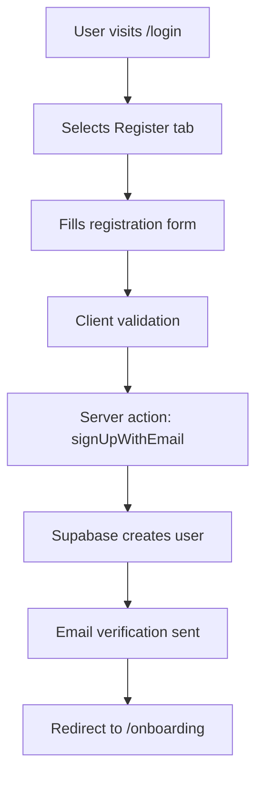
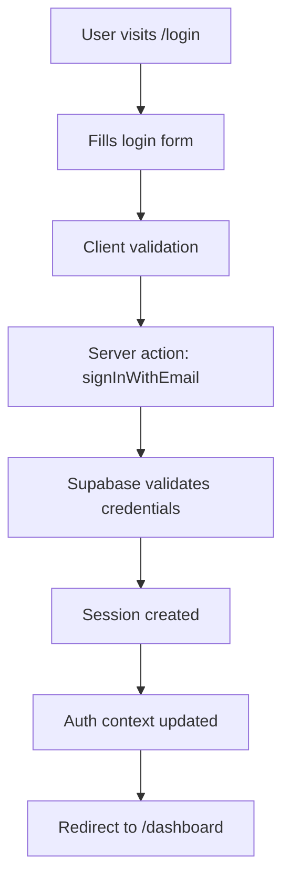
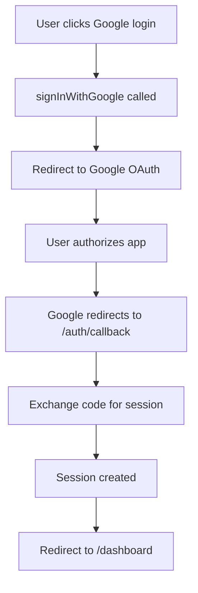
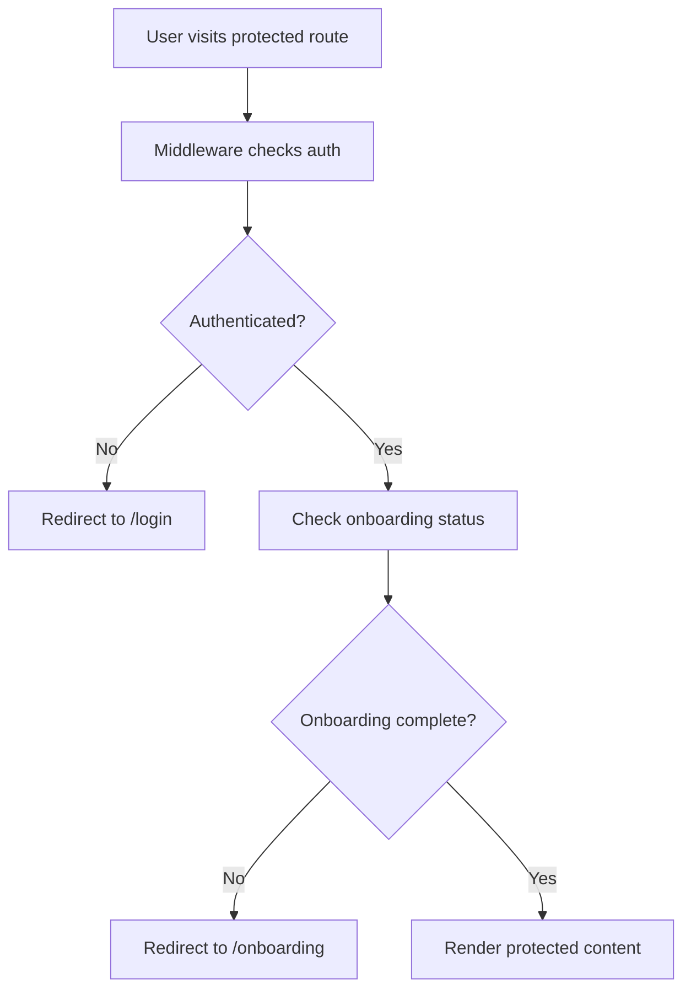

# 🔐 Authentication System Documentation

## Summary

- **Purpose:** Manage user authentication, session flow, and route protection
- **Scope:** Login, registration, OAuth (Google), password reset, user management
- **Stack:** Next.js 15, Supabase Auth, TypeScript, React Context, Server Actions
- **Status:** ✅ Completed (v1.0.0)

## Overview

This document provides a comprehensive overview of the authentication system implemented in the PGAdmit web application. The system is built using **Supabase Auth** with **Next.js 15** and follows modern security best practices.

## 🏗️ Architecture

### Core Components

```
src/
├── features/auth/                    # Authentication feature module
│   ├── model/
│   │   ├── auth-context.tsx         # React Context for auth state
│   │   ├── types.ts                 # TypeScript interfaces
│   │   └── store.ts                 # Auth state management
│   └── ui/                          # UI components
│       ├── login-form/              # Login form component
│       ├── register-form/           # Registration form component
│       ├── protected-route/         # Route protection wrapper
│       └── user-menu/               # User dropdown menu
├── actions/auth.ts                  # Server actions for auth
├── app/
│   ├── (auth)/                      # Auth route group
│   │   └── login/                   # Login page
│   ├── auth/
│   │   └── callback/                # OAuth callback handler
│   └── (protected)/                 # Protected routes
└── lib/supabase/                    # Supabase configuration
    ├── client.ts                    # Client-side Supabase
    ├── server.ts                    # Server-side Supabase
    └── middleware.ts                # Auth middleware
```

## 🔧 Implementation Details

### 1. Authentication Context (`auth-context.tsx`)

The central authentication state management using React Context:

```typescript
interface AuthContextType {
  user: User | null;
  loading: boolean;
  signIn: (email: string, password: string) => Promise<void>;
  signUp: (email: string, password: string) => Promise<void>;
  signOut: () => Promise<void>;
  signInWithGoogle: () => Promise<void>;
  signUpWithGoogle: () => Promise<void>;
}
```

**Key Features:**

- Automatic session restoration on app load
- Real-time auth state changes via Supabase listeners
- Error handling and session validation
- User metadata management (onboarding status, profile data)

### 2. User Interface Components

#### Login Form (`login-form.tsx`)

- Email/password authentication
- Google OAuth integration
- Form validation with error handling
- Loading states and user feedback

#### Register Form (`register-form.tsx`)

- User registration with email verification
- Password strength validation
- Terms acceptance requirement
- Automatic redirect to onboarding

#### Protected Route (`protected-route.tsx`)

- Route protection wrapper component
- Optional onboarding requirement
- Automatic redirects for unauthorized users
- Loading states during auth checks

### 3. Server Actions (`actions/auth.ts`)

Server-side authentication functions:

```typescript
// Email authentication
export async function signInWithEmail(credentials: LoginCredentials);
export async function signUpWithEmail(data: RegisterData);

// OAuth authentication
export async function signInWithGoogle();

// Session management
export async function signOut();
export async function getUser();
export async function getSession();

// Password management
export async function resetPassword(email: string);
```

### 4. Middleware Protection (`middleware.ts`)

Next.js middleware for route protection:

```typescript
const PROTECTED_ROUTES = [
  '/dashboard',
  '/profile',
  '/settings',
  '/onboarding',
  '/applications',
  '/universities',
  '/community',
  '/resources',
];

const AUTH_ROUTES = ['/login', '/signup', '/auth'];
```

**Protection Logic:**

- Redirects unauthenticated users from protected routes to `/login`
- Redirects authenticated users from auth routes to `/dashboard`
- Preserves redirect destination for post-login navigation

### 5. OAuth Callback Handler (`auth/callback/route.ts`)

Handles OAuth provider callbacks:

```typescript
export async function GET(request: NextRequest) {
  const code = searchParams.get('code');
  const next = searchParams.get('next') ?? '/dashboard';

  // Exchange code for session
  const { data, error } = await supabase.auth.exchangeCodeForSession(code);

  // Redirect to intended destination
  return NextResponse.redirect(`${origin}${next}`);
}
```

## 🔒 Security Features

### 1. Session Management

- **Secure Cookies**: HTTP-only, secure, same-site cookies
- **Session Validation**: Server-side session verification
- **Automatic Refresh**: Token refresh on session expiry
- **Cleanup**: Proper session cleanup on logout

### 2. Route Protection

- **Middleware-level**: Server-side route protection
- **Component-level**: Client-side route guards
- **API-level**: Server action authentication checks

### 3. Input Validation

- **Client-side**: Real-time form validation
- **Server-side**: Server action validation
- **Type Safety**: TypeScript interfaces for all auth data

### 4. Error Handling

- **Graceful Degradation**: Fallback states for auth failures
- **User Feedback**: Clear error messages
- **Logging**: Comprehensive error logging for debugging

## 🚀 Authentication Flow

### 1. User Registration Flow



### 2. User Login Flow



### 3. OAuth Flow (Google)



### 4. Protected Route Access



## 📱 User Experience Features

### 1. Loading States

- **Global Loading**: App-wide loading indicator during auth checks
- **Form Loading**: Button loading states during form submission
- **Redirect Loading**: Loading indicator during page transitions

### 2. Error Handling

- **Form Errors**: Field-specific validation errors
- **Network Errors**: Connection and server error handling
- **Auth Errors**: Clear messages for auth failures

### 3. Responsive Design

- **Mobile-first**: Optimized for mobile devices
- **Desktop**: Full-featured desktop experience
- **Tablet**: Adaptive layout for tablet screens

## Dependencies

This feature depends on the following shared utilities and components:

- `lib/supabase/client.ts` — Supabase client configuration
- `lib/supabase/server.ts` — Server-side Supabase client
- `lib/supabase/middleware.ts` — Authentication middleware
- `useToast()` — Global toast notification hook
- `shared/lib/validations/auth.ts` — Authentication form validation schemas
- `shared/ui/*` — Common UI components (Button, Input, Card, etc.)
- `components/ui/badge` — Badge component for user status
- `components/ui/avatar` — User avatar component

## 🔧 Configuration

### Environment Variables

```env
# Supabase Configuration
NEXT_PUBLIC_SUPABASE_URL=your_supabase_url
NEXT_PUBLIC_SUPABASE_ANON_KEY=your_supabase_anon_key
SUPABASE_SERVICE_ROLE_KEY=your_service_role_key

# OAuth Configuration
NEXT_PUBLIC_SITE_URL=http://localhost:3000

# Google OAuth (configured in Supabase dashboard)
# No additional env vars needed
```

### Supabase Setup

1. **Enable Authentication Providers**:
   - Email/Password
   - Google OAuth

2. **Configure OAuth Redirects**:
   - Development: `http://localhost:3000/auth/callback`
   - Production: `https://yourdomain.com/auth/callback`

3. **Set up Email Templates**:
   - Confirmation email
   - Password reset email

## 🧪 Testing

### Test Coverage Areas

1. **Unit Tests**:
   - Auth context functions
   - Form validation logic
   - Utility functions

2. **Integration Tests**:
   - Login/register flows
   - OAuth callbacks
   - Route protection

3. **E2E Tests**:
   - Complete user journeys
   - Cross-browser compatibility
   - Mobile responsiveness

## 🚨 Security Considerations

### 1. Data Protection

- **No Sensitive Data**: No passwords stored in client state
- **Secure Transmission**: HTTPS for all auth communications
- **Token Security**: Secure token storage and transmission

### 2. Session Security

- **Short-lived Tokens**: Configurable token expiration
- **Secure Cookies**: HTTP-only, secure cookie settings
- **CSRF Protection**: Same-site cookie policy

### 3. Input Sanitization

- **Client-side**: Form validation and sanitization
- **Server-side**: Server action validation
- **Database**: Supabase RLS policies

## 📊 Monitoring & Analytics

### 1. Error Tracking

- **Client Errors**: Console logging and error boundaries
- **Server Errors**: Server action error handling
- **Auth Errors**: Supabase error logging

### 2. User Analytics

- **Login Success Rate**: Track authentication success
- **OAuth Usage**: Monitor OAuth vs email login
- **Error Patterns**: Identify common auth issues

## 🔄 Maintenance

### 1. Regular Updates

- **Dependencies**: Keep Supabase and Next.js updated
- **Security Patches**: Apply security updates promptly
- **Feature Updates**: Monitor Supabase auth feature releases

### 2. Monitoring

- **Session Health**: Monitor session creation/expiry
- **Error Rates**: Track authentication error rates
- **Performance**: Monitor auth flow performance

## 📚 Additional Resources

- [Supabase Auth Documentation](https://supabase.com/docs/guides/auth)
- [Next.js Middleware Documentation](https://nextjs.org/docs/app/building-your-application/routing/middleware)
- [React Context Documentation](https://react.dev/reference/react/createContext)
- [OAuth 2.0 Security Best Practices](https://tools.ietf.org/html/draft-ietf-oauth-security-topics)

---

**Author:** gmoinbong  
**Version:** 1.0.0  
**Last Updated:** 2025-10-08  
**Status:** Production-ready
