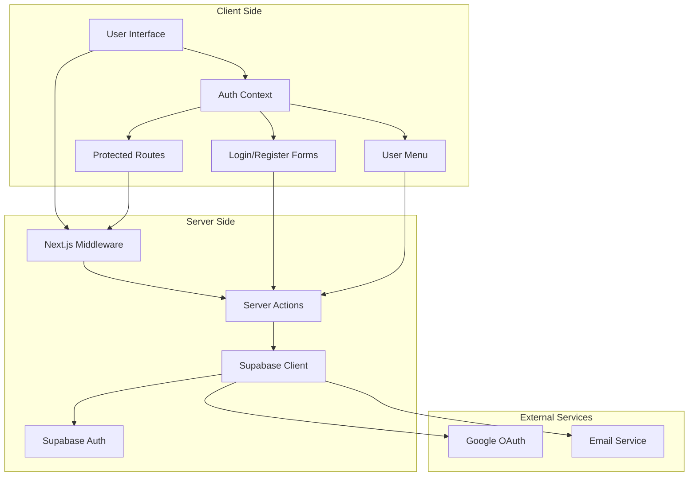
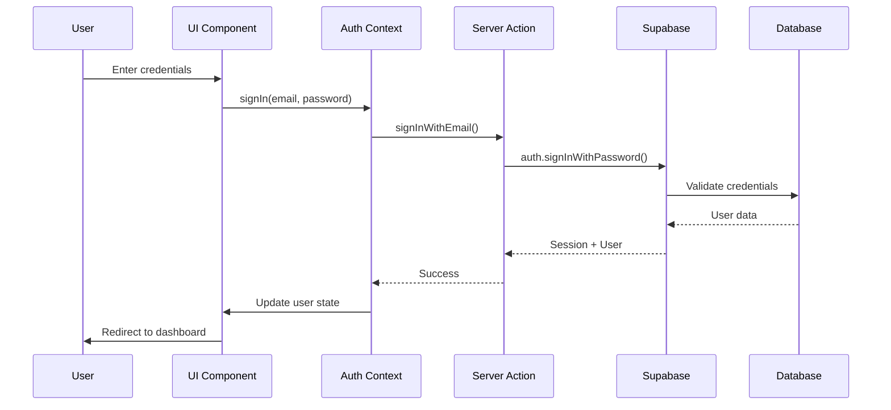
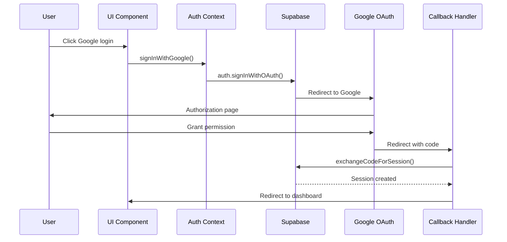
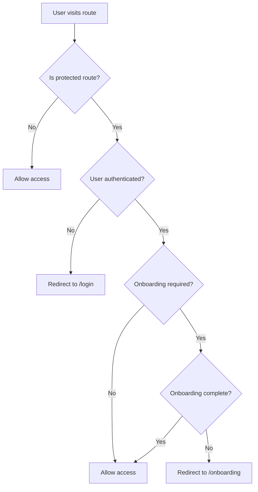
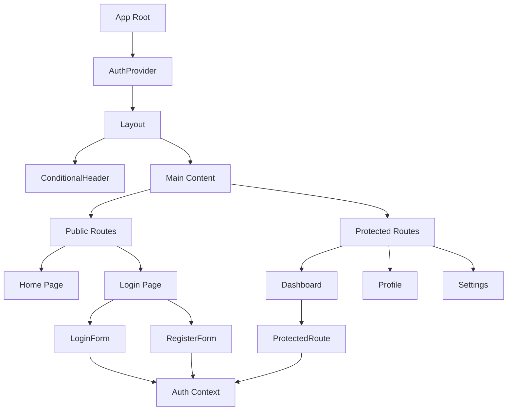
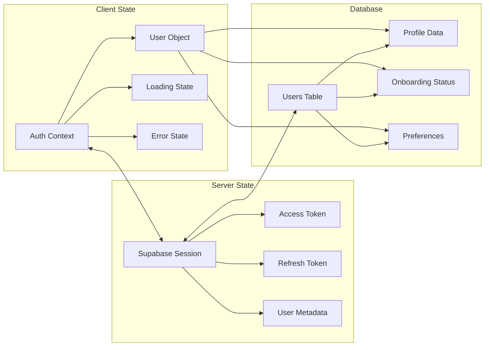
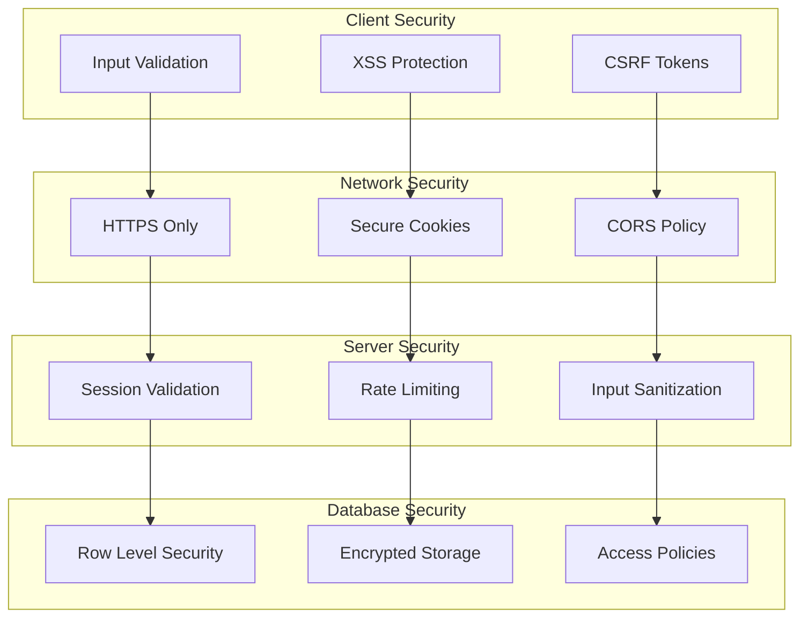
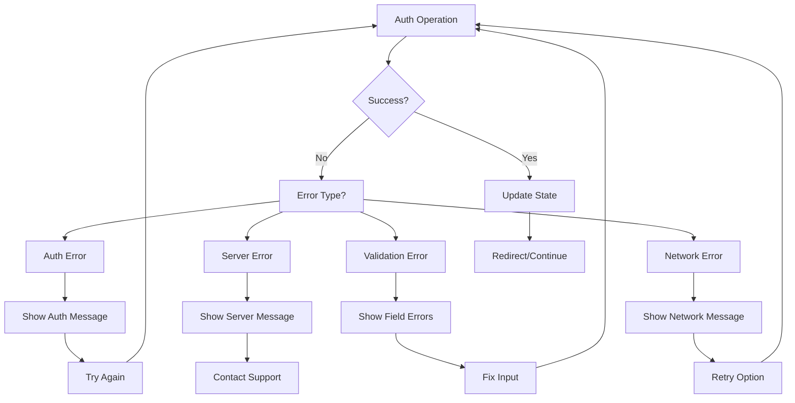
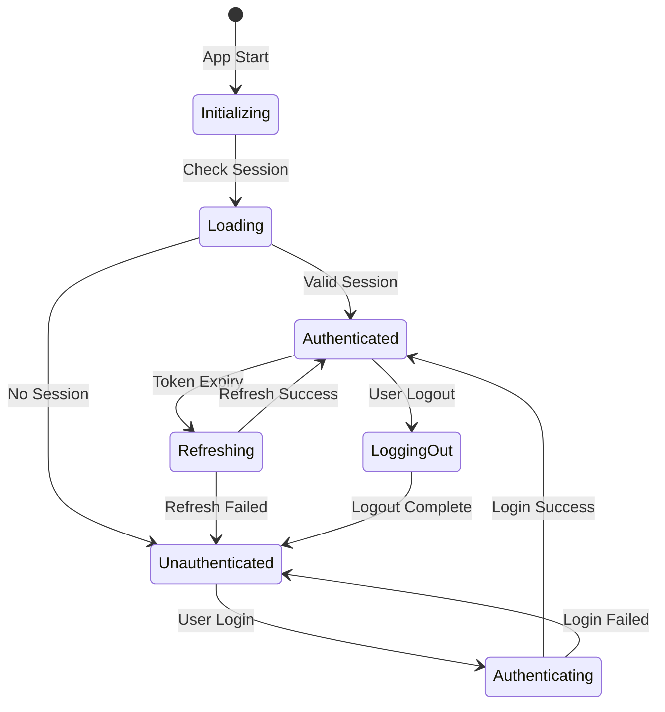

# 🏗️ Authentication Architecture Diagrams

## Summary
- **Purpose:** Visual representation of authentication system architecture and flows
- **Scope:** System diagrams, user flows, component relationships, data flow
- **Stack:** Mermaid diagrams, system architecture documentation
- **Status:** ✅ Completed (v1.0.0)

## System Overview



## Authentication Flow



## OAuth Flow (Google)



## Route Protection Flow



## Component Hierarchy



## Data Flow



## Security Layers



## Error Handling Flow



## Session Management



## File Structure

```
src/
├── features/auth/                    # Authentication feature
│   ├── model/
│   │   ├── auth-context.tsx         # React Context
│   │   ├── types.ts                 # TypeScript types
│   │   └── store.ts                 # State management
│   └── ui/                          # UI components
│       ├── login-form/              # Login form
│       ├── register-form/           # Registration form
│       ├── protected-route/         # Route protection
│       └── user-menu/               # User dropdown
├── actions/auth.ts                  # Server actions
├── app/
│   ├── (auth)/                      # Auth routes
│   │   └── login/                   # Login page
│   ├── auth/
│   │   └── callback/                # OAuth callback
│   └── (protected)/                 # Protected routes
└── lib/supabase/                    # Supabase config
    ├── client.ts                    # Client config
    ├── server.ts                    # Server config
    └── middleware.ts                # Auth middleware
```

---

**Note**: These diagrams are created using Mermaid syntax and can be rendered in any Mermaid-compatible viewer or documentation platform.

---

**Author:** gmoinbong 
**Version:** 1.0.0  
**Last Updated:** 2025-10-08  
**Status:** Production-ready
